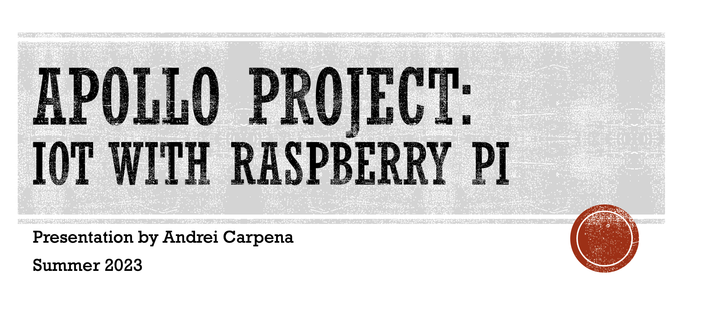
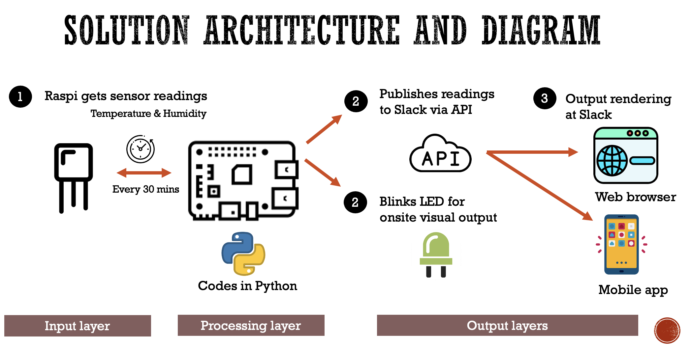

# APOLLO Project

- A summer project I made with my Dad
- Helped me learn real-life application of Python, sensors and APIs

# Components
A Raspberry Pi 4 integrated with AM2302 Digital Temperature and Humidity sensor module

## Hardware
- Raspberry PI 4 
- AM2302 Digital Temperature and Humidity [sensor](https://www.amazon.com/HiLetgo-Temperature-Humidity-Electronic-Practice/dp/B0795F19W6/ref=sr_1_6?crid=15HZ0ZNUY34GN&keywords=am2302+sensor&qid=1682266435&s=hi&sprefix=am2302+senso%2Ctools%2C104&sr=1-6)
- Light Emitting Diode [LED](https://www.amazon.com/dp/B0B5VG7QNY/ref=sspa_dk_detail_0?pd_rd_i=B0B5VG7QNY&pd_rd_w=Ka3jg&content-id=amzn1.sym.3309c9d3-bf37-499a-888c-9ce693c3483f&pf_rd_p=3309c9d3-bf37-499a-888c-9ce693c3483f&pf_rd_r=EMA83164Y6J3544V14RF&pd_rd_wg=L5QTq&pd_rd_r=a5b66152-424e-476a-97ee-eaf81b1928f3&s=hi&sp_csd=d2lkZ2V0TmFtZT1zcF9kZXRhaWxfdGhlbWF0aWM&spLa=ZW5jcnlwdGVkUXVhbGlmaWVyPUEyTTNDVjdCUE1aUjNUJmVuY3J5cHRlZElkPUEwNjM2NzMxM0dTMzZISk1CQjdWTiZlbmNyeXB0ZWRBZElkPUEwNDM0MjAwMkxGVDgxT1MxTEgyJndpZGdldE5hbWU9c3BfZGV0YWlsX3RoZW1hdGljJmFjdGlvbj1jbGlja1JlZGlyZWN0JmRvTm90TG9nQ2xpY2s9dHJ1ZQ&th=1)
- Raspi jumper [wires](https://www.amazon.com/raspberry-pi-jumper-wires/s?k=raspberry+pi+jumper+wires)

## Software
- Operating system: Raspian GNU/Linux
- Python3
- Slack API 
    - Documentations [here](https://api.slack.com/)
    - Webhooks are event-driven APIs. Documentations [here](https://api.slack.com/messaging/webhooks)

# Info and Solution Architecture

